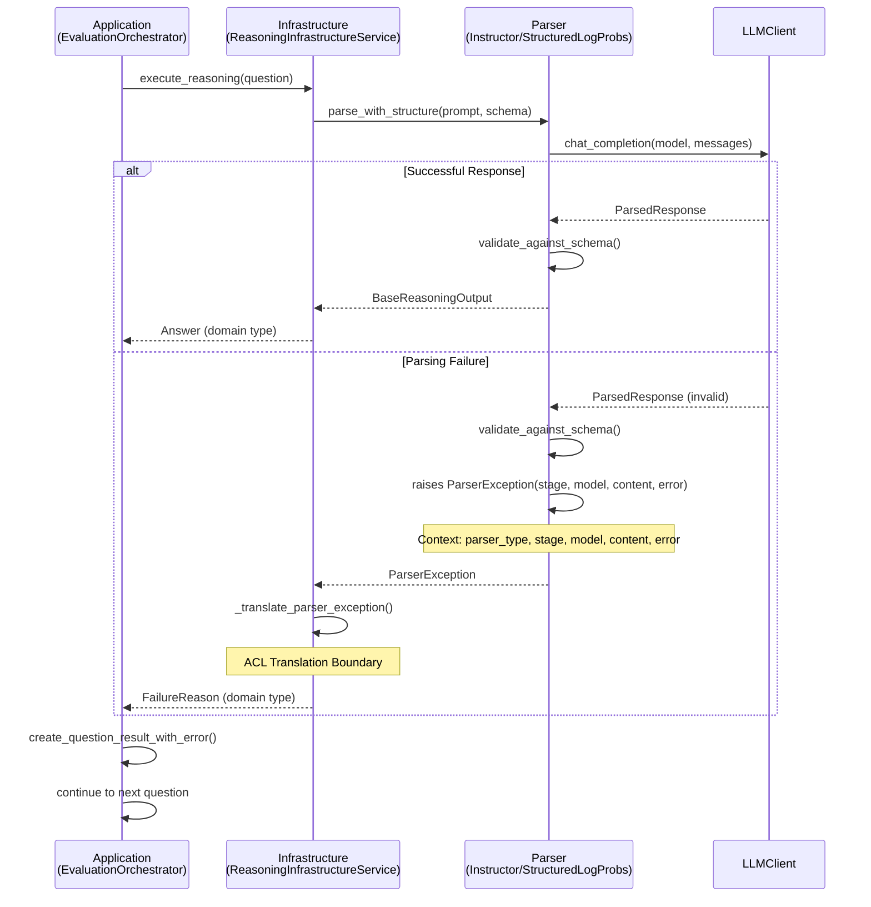

# Structured Output Parsing - BDD/TDD Implementation Plan

## Overview

This document outlines the BDD/TDD approach to fix the structured output parsing issues, specifically the InstructorParser implementation that currently fails with "Invalid JSON" errors.

## Problem Statement

The current InstructorParser:

1. Sends natural language prompts without JSON formatting instructions
2. Expects JSON responses from models that receive no structured output guidance
3. Falls back to raw text when JSON parsing fails
4. Was never properly implemented according to the documented design

## Core Principles

1. **No Fallback**: If the assigned parsing method fails, it's a technical failure. No fallback to alternative parsing strategies.
2. **Single Strategy**: Each model uses exactly one parsing strategy based on capabilities.
3. **Clear Failures**: Parsing failures map to domain `FailureReason` at ACL boundary.
4. **Type Isolation**: Application layer never sees infrastructure exceptions.

## BDD Scenarios

### Feature: Parser Selection Based on Model Capabilities

```gherkin
Scenario: Select StructuredLogProbsParser for models supporting logprobs
  Given a model that supports logprobs capability
  When I create a parser for this model
  Then it should return a StructuredLogProbsParser instance
  And log "Selected StructuredLogProbsParser"

Scenario: Select InstructorParser for models without logprobs support
  Given a model that doesn't support logprobs capability
  When I create a parser for this model
  Then it should return an InstructorParser instance
  And log "Selected InstructorParser"
```

### Feature: StructuredLogProbsParser Behavior

```gherkin
Scenario: StructuredLogProbsParser uses native structured output
  Given a StructuredLogProbsParser instance
  And a DirectAnswerOutput schema
  When I parse a question
  Then the request should include response_format parameter
  And logprobs should be enabled
  And the response should be validated against the schema

Scenario: StructuredLogProbsParser handles structured data response
  Given a StructuredLogProbsParser receives a response with structured_data
  When I parse the response
  Then it should use the structured_data directly
  And return a valid parsed output object

Scenario: StructuredLogProbsParser handles content-only response
  Given a StructuredLogProbsParser receives a response with only content
  When I parse the response
  Then it should parse the content as JSON
  And return a valid parsed output object

Scenario: StructuredLogProbsParser raises exception on parsing failure
  Given a StructuredLogProbsParser receives invalid response
  When parsing fails
  Then it should raise ParserException with stage="json_parse"
  And include parser_type="StructuredLogProbsParser"
  And include model name and content
```

### Feature: InstructorParser Behavior

```gherkin
Scenario: InstructorParser adds JSON schema instructions to prompts
  Given an InstructorParser instance
  And a DirectAnswerOutput schema requiring {"answer": "string"}
  When I parse a question "What is 2+2?"
  Then the prompt should include JSON schema instructions
  And specify the exact format: {"answer": "your answer here"}
  And include validation requirements

Scenario: InstructorParser successfully parses JSON response
  Given an InstructorParser receives a valid JSON response
  When I parse the response
  Then it should validate against the schema
  And return the structured data
  And log successful parsing

Scenario: InstructorParser raises exception on malformed JSON
  Given an InstructorParser receives malformed JSON
  When I attempt to parse it
  Then it should raise ParserException with stage="json_parse"
  And include the malformed content
  And include the original JSON error

Scenario: InstructorParser raises exception on schema validation failure
  Given an InstructorParser receives valid JSON that doesn't match schema
  When I attempt to validate it
  Then it should raise ParserException with stage="schema_validation"
  And include the validation error details

Scenario: InstructorParser raises exception on empty responses
  Given an InstructorParser receives an empty response
  When I attempt to parse it
  Then it should raise ParserException with stage="response_empty"
  And include the empty response details
```

### Feature: Anti-Corruption Layer Translation

```gherkin
Scenario: ParserException translates to domain FailureReason
  Given a ParserException is raised in infrastructure
  When the ReasoningInfrastructureService catches it
  Then it should translate to FailureReason
  And set category to PARSING_ERROR
  And include parser_type and stage in description
  And preserve technical details for debugging

Scenario: Application layer never sees ParserException
  Given any parsing failure occurs
  When the application service receives the result
  Then it should receive a FailureReason object
  And never import or catch ParserException
```

### Feature: Error Handling and Logging

```gherkin
Scenario: Detailed error logging for debugging
  Given any parser encounters an error
  When parsing fails
  Then it should log the parser_type and stage
  And include the raw response content
  And provide model context information
  And include the original error details
```

## Implementation Plan

### Phase 1: Exception Design and ACL Translation

#### 1.1 Simple Exception with Rich Context

```python
# src/ml_agents_v2/infrastructure/structured_output/exceptions.py

class ParserException(Exception):
    """Single exception type for all parsing failures with rich context."""

    def __init__(
        self,
        parser_type: str,  # "InstructorParser" | "StructuredLogProbsParser"
        model: str,
        stage: str,  # "json_parse" | "schema_validation" | "response_empty"
        content: str,
        error: Exception
    ):
        self.parser_type = parser_type
        self.model = model
        self.stage = stage
        self.content = content
        self.original_error = error
        super().__init__(f"{parser_type} failed at {stage}: {error}")
```

#### 1.2 ACL Translation in ReasoningInfrastructureService

```python
# src/ml_agents_v2/infrastructure/reasoning_service.py
from datetime import datetime

class ReasoningInfrastructureService:
    async def execute_reasoning(
        self,
        domain_service: ReasoningAgentService,
        question: Question,
        config: AgentConfig
    ) -> Answer | FailureReason:
        try:
            # Domain: Get complete prompt using domain strategy
            domain_prompt = domain_service.process_question(question, config)

            # Infrastructure: Add JSON schema formatting
            enhanced_prompt = self._add_json_schema_instructions(domain_prompt, output_schema)

            # ... parsing logic ...
            return self._convert_to_answer(reasoning_result, parsed_response.token_usage, execution_time)
        except ParserException as e:
            # ACL Boundary - translate to domain type
            return self._translate_parser_exception(e)

    def _translate_parser_exception(self, error: ParserException) -> FailureReason:
        """ACL boundary - map parser failures to domain FailureReason.

        Note: Uses string "parsing_error" not enum, per domain model implementation.
        """
        return FailureReason(
            category="parsing_error",  # String constant from VALID_FAILURE_CATEGORIES
            description=f"{error.parser_type} failed at {error.stage}",
            technical_details=(
                f"Model: {error.model}\n"
                f"Stage: {error.stage}\n"
                f"Original Error: {error.original_error}\n"
                f"Content: {error.content[:200]}..."
            ),
            occurred_at=datetime.now(),
            recoverable=False
        )
```

### Phase 2: Test Infrastructure Setup

#### 2.1 Create Test Framework

```python
# tests/unit/infrastructure/test_structured_output_bdd.py
class TestParserSelection:
    """BDD tests for parser selection logic"""

class TestStructuredLogProbsParser:
    """BDD tests for StructuredLogProbsParser behavior"""

class TestInstructorParser:
    """BDD tests for InstructorParser behavior"""

class TestACLTranslation:
    """BDD tests for exception translation at ACL boundary"""
```

#### 2.2 Create Test Fixtures

```python
# tests/fixtures/structured_output_fixtures.py

@pytest.fixture
def mock_llm_client():
    """Mock LLM client for testing parser behavior.

    Uses mock responses for fast, deterministic, repeatable tests.
    Real model responses reserved for separate integration tests.
    """
    mock = Mock(spec=LLMClient)
    return mock

@pytest.fixture
def sample_responses():
    """Mock responses covering all test scenarios.

    Crafted to test specific edge cases rather than real model output.
    Enables offline testing of all failure modes consistently.
    """
    return {
        'valid_json': '{"answer": "4"}',
        'invalid_json': '{"answer": incomplete',
        'empty': '',
        'wrong_schema': '{"wrong_field": "value"}',
        'natural_language': 'The answer is four because two plus two equals four.',
    }

@pytest.fixture
def sample_domain_prompts():
    """Domain prompts from PromptStrategy instances.

    Tests use actual domain strategies (NONE_STRATEGY, CHAIN_OF_THOUGHT_STRATEGY)
    to ensure infrastructure properly enhances domain prompts.
    """
    return {
        'none': NONE_STRATEGY.build_prompt(Question(id="1", text="What is 2+2?", expected_answer="4")),
        'cot': CHAIN_OF_THOUGHT_STRATEGY.build_prompt(Question(id="1", text="What is 2+2?", expected_answer="4")),
    }
```

### Phase 3: Define Expected Behaviors Through Tests

#### 3.1 Parser Selection Tests

```python
def test_selects_structured_logprobs_parser_for_logprobs_models():
    """Given model supports logprobs, when creating parser, then returns StructuredLogProbsParser"""

def test_selects_instructor_parser_for_non_logprobs_models():
    """Given model doesn't support logprobs, when creating parser, then returns InstructorParser"""
```

#### 3.2 InstructorParser Core Behavior Tests

```python
def test_instructor_parser_adds_json_schema_to_domain_prompt(sample_domain_prompts):
    """Given domain prompt from PromptStrategy, when parsing, then adds JSON schema instructions.

    Domain provides: "Answer the following question directly:\n\nQuestion: What is 2+2?"
    Infrastructure adds: JSON schema with model_json_schema() output
    """
    parser = InstructorParser(mock_llm_client)
    domain_prompt = sample_domain_prompts['none']  # From NONE_STRATEGY

    enhanced_prompt = parser._add_json_schema_instructions(domain_prompt, DirectAnswerOutput)

    assert domain_prompt in enhanced_prompt  # Domain prompt preserved
    assert '"answer"' in enhanced_prompt  # JSON schema added
    assert 'valid JSON' in enhanced_prompt  # Instructions added

def test_instructor_parser_parses_valid_json_response(sample_responses):
    """Given valid JSON response (mock), when parsing, then returns structured data"""
    # Uses mock response for fast, deterministic testing

def test_instructor_parser_raises_exception_on_malformed_json(sample_responses):
    """Given malformed JSON (mock), when parsing, then raises ParserException with stage='json_parse'"""
    # Uses crafted mock to test specific failure mode

def test_instructor_parser_raises_exception_on_schema_mismatch():
    """Given valid JSON that doesn't match schema, when parsing, then raises ParserException with stage='schema_validation'"""

def test_instructor_parser_raises_exception_on_empty_response():
    """Given empty response, when parsing, then raises ParserException with stage='response_empty'"""

def test_parser_exception_contains_full_context():
    """Given parsing failure, when exception raised, then contains parser_type, model, stage, content, error"""
```

#### 3.3 StructuredLogProbsParser Tests

```python
def test_structured_logprobs_uses_response_format():
    """Given schema, when parsing, then request includes response_format parameter"""

def test_structured_logprobs_uses_structured_data_when_available():
    """Given response with structured_data, when parsing, then uses structured_data"""

def test_structured_logprobs_parses_content_as_json_fallback():
    """Given response with only content, when parsing, then parses content as JSON"""

def test_structured_logprobs_raises_exception_on_failure():
    """Given parsing failure, when error occurs, then raises ParserException with parser_type='StructuredLogProbsParser'"""
```

#### 3.4 ACL Translation Tests

```python
def test_parser_exception_translates_to_failure_reason():
    """Given ParserException in infrastructure, when caught by service, then returns FailureReason"""

def test_failure_reason_contains_parser_context():
    """Given translated FailureReason, when inspected, then contains parser_type and stage in description"""

def test_application_never_sees_parser_exception():
    """Given parsing failure, when application calls service, then receives FailureReason not exception"""
```

### Phase 4: Parser Implementation

#### 4.1 Prompt Enhancement

```python
class InstructorParser:
    def _add_json_schema_instructions(self, domain_prompt: str, output_model: type[BaseReasoningOutput]) -> str:
        """Add JSON formatting requirements to domain prompt.

        Domain provides complete prompt using PromptStrategy (NONE_STRATEGY or CHAIN_OF_THOUGHT_STRATEGY).
        Infrastructure adds technical JSON schema formatting instructions.

        Uses model_json_schema() directly - single source of truth, no schema drift.
        """
        schema = output_model.model_json_schema()

        json_instructions = f"""

You must respond with valid JSON matching this exact schema:
{json.dumps(schema, indent=2)}

Do not include any text outside the JSON structure.
Your entire response must be valid JSON only.
"""
        return domain_prompt + json_instructions
```

#### 4.2 Response Processing with Exceptions

```python
    def _parse_json_response(self, content: str, model_name: str) -> dict:
        """Parse JSON response - raise ParserException on failure"""
        if not content or not content.strip():
            raise ParserException(
                parser_type="InstructorParser",
                model=model_name,
                stage="response_empty",
                content=content,
                error=ValueError("Empty response")
            )

        try:
            return json.loads(content)
        except json.JSONDecodeError as e:
            raise ParserException(
                parser_type="InstructorParser",
                model=model_name,
                stage="json_parse",
                content=content,
                error=e
            )

    def _validate_against_schema(self, data: dict, model: type, model_name: str, content: str) -> BaseReasoningOutput:
        """Validate parsed data against Pydantic model"""
        try:
            return model.model_validate(data)
        except ValidationError as e:
            raise ParserException(
                parser_type="InstructorParser",
                model=model_name,
                stage="schema_validation",
                content=content,
                error=e
            )
```

### Phase 5: Integration Testing

#### 5.1 End-to-End Parser Tests

```python
def test_instructor_parser_end_to_end_with_mock_model():
    """Test complete flow from prompt generation to structured output"""

def test_structured_logprobs_parser_end_to_end():
    """Test complete flow for StructuredLogProbsParser"""
```

#### 5.2 ACL Integration Tests

```python
def test_reasoning_service_catches_parser_exception_and_returns_failure_reason():
    """Test that ReasoningInfrastructureService translates ParserException to FailureReason"""

def test_application_orchestrator_receives_domain_types_only():
    """Test that EvaluationOrchestrator never imports ParserException"""
```

### Phase 6: Evaluation Integration Testing

#### 6.1 Acceptance Tests

```python
def test_evaluation_handles_parsing_failures_gracefully():
    """Test that evaluations continue when individual questions fail to parse"""

def test_different_models_produce_valid_structured_output():
    """Test that both parser types work in real evaluation scenarios"""

def test_parsing_failures_counted_as_question_failures():
    """Test that parsing failures are tracked in evaluation results"""

def test_evaluation_logs_parser_failure_context():
    """Test that failure_reason includes parser_type and stage information"""
```

### Phase 7: JSON Schema Instruction Verification

#### 7.1 Mock Call Argument Testing
Tests that verify the exact parameters sent to LLM clients, ensuring JSON schema instructions are properly added.

#### 7.2 Production API Integration Testing
Tests with real OpenRouter calls to verify end-to-end instruction formatting works with actual model responses.

#### 7.3 ACL Boundary Protection Testing
Tests that verify fallback error handling doesn't bypass structured output parsing exceptions.

### Feature: JSON Schema Instruction Verification

```gherkin
Scenario: InstructorParser adds schema instructions to API call
  Given an InstructorParser with DirectAnswerOutput schema
  When I call parse() with domain prompt "What is 2+2?"
  Then the LLM client should receive enhanced prompt
  And the prompt should contain original domain text
  And the prompt should contain "You must respond with valid JSON"
  And the prompt should contain the exact JSON schema
  And the prompt should contain formatting restrictions

Scenario: Mock call arguments capture instruction formatting
  Given a mocked LLM client
  When InstructorParser processes a request
  Then I can verify the messages parameter contains enhanced prompt
  And I can verify the model parameter includes provider prefix
  And I can verify no response_format parameter is added

Scenario: StructuredLogProbsParser adds response_format parameter
  Given a StructuredLogProbsParser with ChainOfThoughtOutput schema
  When I call parse() with any prompt
  Then the LLM client should receive response_format parameter
  And the response_format should match the Pydantic schema
  And logprobs should be enabled
```

#### 7.4 Implementation Patterns for Testing

```python
def test_instructor_parser_enhances_domain_prompt():
    """Verify JSON schema instructions are added to domain prompts"""
    # Setup
    parser = InstructorParser(mock_llm_client)
    domain_prompt = "Answer this question: What is 2+2?"

    # Execute
    await parser.parse(DirectAnswerOutput, domain_prompt, config)

    # Verify call arguments
    call_args = mock_llm_client.chat_completion.call_args
    sent_messages = call_args.kwargs["messages"]
    actual_prompt = sent_messages[0]["content"]

    # Assertions
    assert domain_prompt in actual_prompt  # Domain preserved
    assert "You must respond with valid JSON" in actual_prompt
    assert '"answer"' in actual_prompt  # Schema included
    assert "Do not include any text outside" in actual_prompt

def test_structured_logprobs_parser_sets_response_format():
    """Verify StructuredLogProbsParser adds response_format parameter"""
    # Setup
    parser = StructuredLogProbsParser(mock_llm_client)

    # Execute
    await parser.parse(ChainOfThoughtOutput, "test prompt", config)

    # Verify call arguments
    call_args = mock_llm_client.chat_completion.call_args
    assert "response_format" in call_args.kwargs
    assert call_args.kwargs["logprobs"] is True

    response_format = call_args.kwargs["response_format"]
    assert response_format["type"] == "json_schema"
    assert "json_schema" in response_format

def test_acl_boundary_protection():
    """Verify ParserException doesn't leak through error mapper fallback"""
    # Setup with real error mapper (not mocked)
    service = ReasoningInfrastructureService(mock_llm_client, real_error_mapper)

    # Force ParserException
    with patch.object(mock_llm_client, 'chat_completion') as mock_call:
        mock_call.side_effect = ValueError("Empty response")  # Triggers ParserException

        # Execute
        result = await service.execute_reasoning(domain_service, question, config)

        # Verify ACL translation occurred
        assert isinstance(result, FailureReason)
        assert result.category == "parsing_error"
        assert "InstructorParser failed at response_empty" in result.description
        # Should NOT be the generic OpenRouter error message
        assert "Failed to parse response from OpenRouter API" not in result.description
```

## Exception Flow Diagram



## Success Criteria

### Behavioral Requirements

1. **Parser Selection**: Correct parser type selected based on model capabilities
2. **JSON Schema Instructions**: InstructorParser adds proper JSON formatting to prompts
3. **Structured Parsing**: Both parsers return valid structured output or raise ParserException
4. **ACL Translation**: All ParserExceptions translate to FailureReason at infrastructure boundary
5. **Type Isolation**: Application layer never imports or catches ParserException
6. **Clear Failures**: Parsing failures logged with full context (parser_type, stage, model, content)
7. **Evaluation Continuity**: Evaluations continue processing when individual questions fail

### Technical Requirements

1. **100% Test Coverage**: All BDD scenarios have corresponding tests
2. **Green Test Suite**: All tests pass before implementation is complete
3. **Logging Integration**: Comprehensive debug logging for troubleshooting
4. **Backward Compatibility**: Existing evaluations continue to work
5. **Performance**: No significant performance degradation

## Implementation Order

1. **Create ParserException** with comprehensive context fields
2. **Write failing tests** for all BDD scenarios
3. **Implement ACL translation** in ReasoningInfrastructureService
4. **Implement JSON schema prompt enhancement** in InstructorParser
5. **Add ParserException raising** at all failure points
6. **Update evaluation orchestrator** to handle FailureReason from parsing failures
7. **Enhance logging** with parser context
8. **Validate with real model integration** testing
9. **Run acceptance tests** with actual evaluations

## Rollback Plan

If implementation issues occur:

1. **Revert parser changes** while keeping debug logging
2. **Keep current error handling** as interim solution
3. **Analyze test failures** to understand root causes
4. **Implement fixes incrementally** with test validation

## Testing Methodology: Comprehensive API Integration Verification

### Layer 1: Unit Tests with Mock Verification
- **Purpose**: Verify instruction formatting logic in isolation
- **Approach**: Mock LLM client, capture call arguments, verify parameters
- **Coverage**: JSON schema instruction injection, parameter formatting
- **Benefits**: Fast execution, deterministic results, comprehensive edge case coverage

### Layer 2: Integration Tests with Real APIs
- **Purpose**: Verify end-to-end instruction effectiveness
- **Approach**: Real OpenRouter calls with actual models
- **Coverage**: Model compatibility, response parsing, error handling
- **Benefits**: Real-world validation, model-specific behavior verification

### Layer 3: ACL Boundary Protection Tests
- **Purpose**: Verify exception translation integrity
- **Approach**: Test that infrastructure exceptions don't leak to application
- **Coverage**: ParserException → FailureReason translation, error mapper isolation
- **Benefits**: Architectural boundary enforcement, proper separation of concerns

### Test Data Strategy

#### Mock Data (Layer 1)
- **Deterministic responses** for fast unit testing
- **Crafted edge cases** to test specific failure modes
- **Perfect control** over response content and structure
- **Enables offline testing** of all parsing scenarios

#### Real API Data (Layer 2)
- **Actual model responses** for integration validation
- **Real network conditions** and API behavior
- **Model-specific quirks** and response patterns
- **End-to-end verification** of instruction effectiveness

#### Boundary Data (Layer 3)
- **Exception scenarios** to test ACL protection
- **Error mapper interactions** to verify proper routing
- **Application layer isolation** verification
- **Architectural compliance** testing

### Continuous Verification Strategy

#### Pre-commit Hooks
- **Unit tests with mock verification** must pass
- **JSON schema instruction formatting** tests required
- **ACL boundary protection** tests must pass
- **Fast feedback loop** for development

#### CI Pipeline Testing
- **Integration tests with real APIs** on key models
- **Production scenario validation** with actual OpenRouter
- **Error handling verification** across model types
- **Performance impact assessment**

#### Production Monitoring
- **Error categorization** validates ACL boundaries
- **Parsing failure rates** by model and parser type
- **Instruction formatting effectiveness** metrics
- **Real-world validation** of testing approach

### Testing Implementation Guidelines

#### Mock Call Verification Pattern
```python
# Verify exact parameters sent to API
call_args = mock_llm_client.chat_completion.call_args
assert "expected_content" in call_args.kwargs["messages"][0]["content"]
assert call_args.kwargs["model"] == "provider/model-name"
```

#### Real API Integration Pattern
```python
# Test with actual OpenRouter models
@pytest.mark.integration
async def test_real_api_instruction_formatting():
    real_client = OpenRouterClient(api_key=test_api_key)
    parser = InstructorParser(real_client)
    # Verify actual JSON schema instructions work
```

#### ACL Boundary Protection Pattern
```python
# Ensure proper exception translation
def test_acl_boundary_enforcement():
    # Force ParserException in infrastructure
    # Verify FailureReason returned to application
    # Confirm no infrastructure leakage
```

This comprehensive testing methodology ensures JSON schema instruction formatting works correctly across all layers, from isolated unit tests to production integration, while maintaining proper architectural boundaries and providing clear failure modes.

---

This plan ensures we understand the expected behavior before implementing fixes, leading to a robust and well-tested solution with clear failure modes and proper ACL boundaries.
