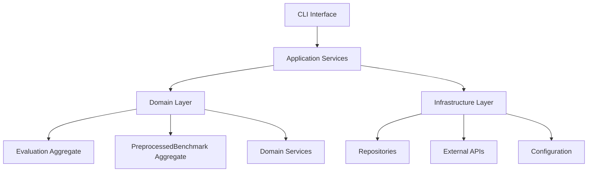
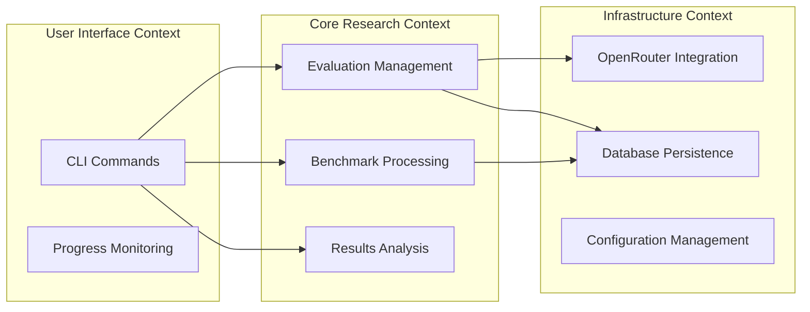
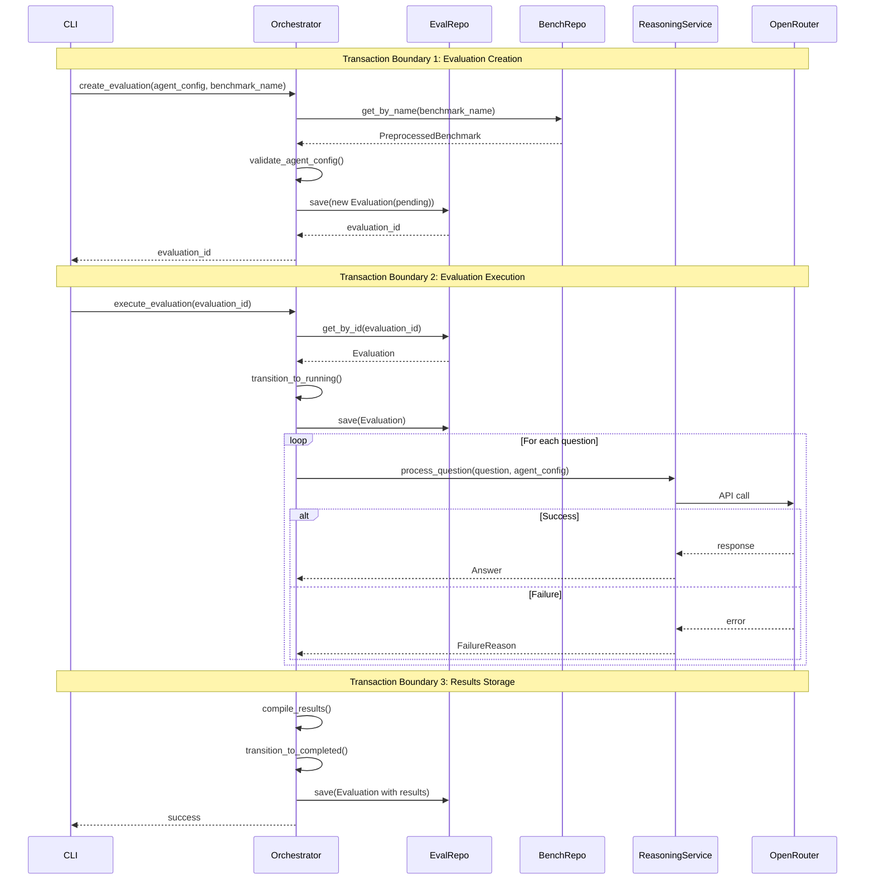
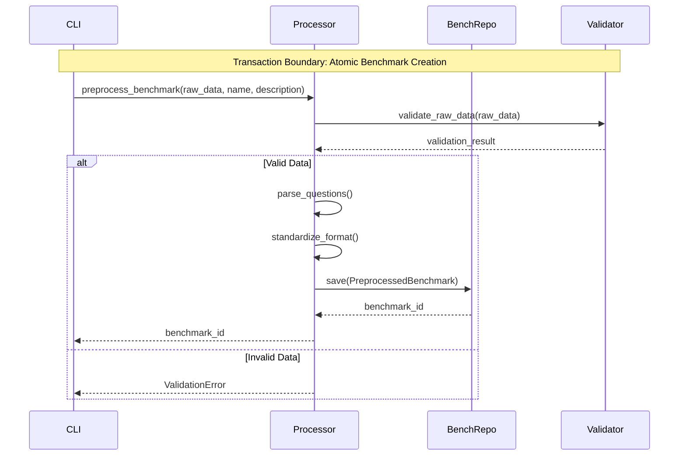
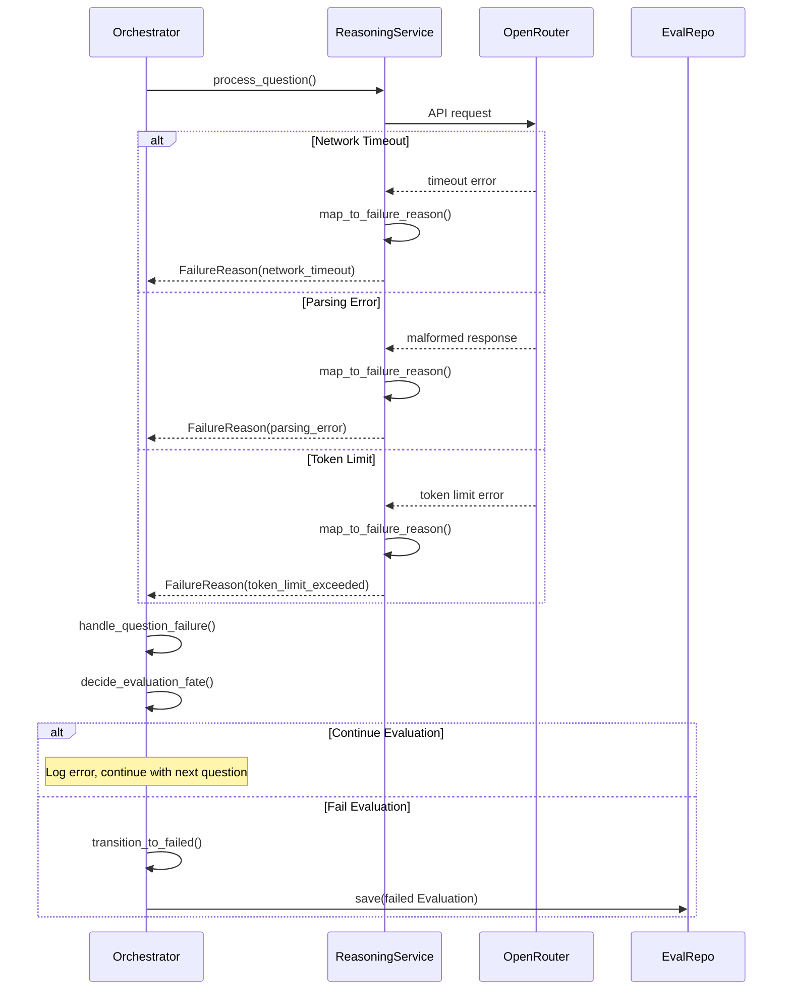
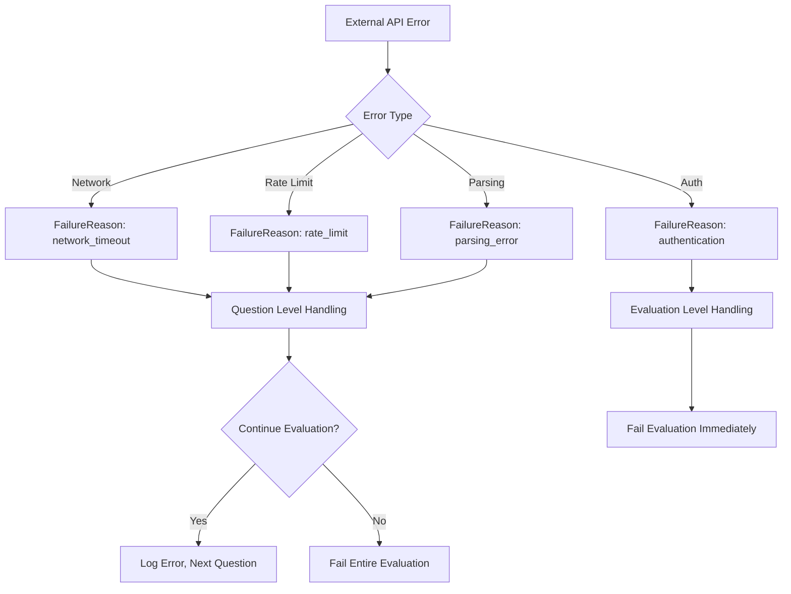
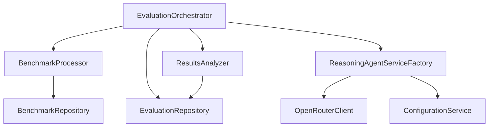

# Application Services Architecture

**Version:** 1.0
**Date:** 2025-09-17
**Purpose:** Define orchestration layer between domain and infrastructure

## Architecture Overview

Application services orchestrate domain operations without containing business logic. They coordinate transactions, handle cross-aggregate operations, and translate between external APIs and domain concepts.



## Bounded Context Mapping



## Application Service Interfaces

### EvaluationOrchestrator

Primary service coordinating evaluation lifecycle.

```python
class EvaluationOrchestrator:
    def __init__(
        self,
        evaluation_repo: EvaluationRepository,
        benchmark_repo: PreprocessedBenchmarkRepository,
        reasoning_service_factory: ReasoningAgentServiceFactory,
        config: ApplicationConfig
    ):
        pass

    def create_evaluation(
        self,
        agent_config: AgentConfig,
        benchmark_name: str
    ) -> EvaluationId:
        """Create new evaluation in pending state"""
        pass

    def execute_evaluation(self, evaluation_id: EvaluationId) -> None:
        """Execute evaluation asynchronously"""
        pass

    def get_evaluation_status(self, evaluation_id: EvaluationId) -> EvaluationStatus:
        """Check current evaluation state"""
        pass

    def get_evaluation_results(self, evaluation_id: EvaluationId) -> EvaluationResults:
        """Retrieve completed evaluation results"""
        pass
```

### BenchmarkProcessor

Handles benchmark preprocessing and management.

```python
class BenchmarkProcessor:
    def __init__(
        self,
        benchmark_repo: PreprocessedBenchmarkRepository,
        config: ApplicationConfig
    ):
        pass

    def preprocess_benchmark(
        self,
        raw_data: str,
        benchmark_name: str,
        description: str
    ) -> BenchmarkId:
        """Process raw benchmark data into standardized format"""
        pass

    def list_available_benchmarks(self) -> List[BenchmarkInfo]:
        """Get all preprocessed benchmarks"""
        pass

    def get_benchmark_details(self, benchmark_name: str) -> PreprocessedBenchmark:
        """Retrieve specific benchmark with questions"""
        pass
```

### ResultsAnalyzer

Provides analysis and reporting capabilities.

```python
class ResultsAnalyzer:
    def __init__(
        self,
        evaluation_repo: EvaluationRepository,
        config: ApplicationConfig
    ):
        pass

    def get_evaluation_summary(self, evaluation_id: EvaluationId) -> EvaluationSummary:
        """Get high-level results summary"""
        pass

    def export_detailed_results(
        self,
        evaluation_id: EvaluationId,
        format: ExportFormat
    ) -> str:
        """Export detailed results to CSV/JSON"""
        pass

    def list_evaluations(
        self,
        filters: EvaluationFilters = None
    ) -> List[EvaluationInfo]:
        """List evaluations with optional filtering"""
        pass
```

## Core Workflows with Sequence Diagrams

### 1. Create and Execute Evaluation



### 2. Benchmark Preprocessing



### 3. Error Propagation Flow



## Transaction Boundaries

### 1. Evaluation Creation Transaction

- **Scope:** Validate config → Create evaluation entity → Persist
- **Rollback Triggers:** Invalid agent config, duplicate evaluation, benchmark not found
- **Isolation:** Read committed (concurrent creations allowed)

### 2. Question Processing Transaction

- **Scope:** Per-question processing and individual result storage
- **Rollback Triggers:** Critical system errors (not LLM failures)
- **Isolation:** Optimistic locking on evaluation record

### 3. Results Compilation Transaction

- **Scope:** Aggregate all answers → Compute metrics → Update evaluation
- **Rollback Triggers:** Calculation errors, concurrent modification
- **Isolation:** Pessimistic lock on evaluation during completion

### 4. Benchmark Creation Transaction

- **Scope:** Parse raw data → Validate questions → Create benchmark
- **Rollback Triggers:** Invalid format, duplicate name, parsing errors
- **Isolation:** Exclusive lock on benchmark name

## Error Handling Strategy

### Error Categories and Propagation



### Failure Recovery Patterns

1. **Question-Level Failures:** Log and continue
2. **Configuration Failures:** Fail fast during creation
3. **Infrastructure Failures:** Retry with exponential backoff
4. **Business Logic Failures:** Immediate failure with detailed context

## Cross-Service Communication

### Service Dependencies



### Interface Contracts

- **Repository Interfaces:** Domain-driven, infrastructure-agnostic
- **External Service Interfaces:** Abstracted behind domain services
- **Configuration Interfaces:** Environment-aware, validation included

## Concurrency and Performance

### Async Operation Patterns

- **Evaluation Execution:** Fire-and-forget with status polling
- **Question Processing:** Sequential (simplicity over parallelization)
- **Results Retrieval:** Cached after completion

### Resource Management

- **Connection Pooling:** OpenRouter API connections
- **Rate Limiting:** Built into OpenRouter client
- **Memory Management:** Stream large result sets

## Validation Layers

### Input Validation

```python
@dataclass
class ValidationResult:
    is_valid: bool
    errors: List[str]
    warnings: List[str]
```

1. **CLI Layer:** Basic input sanitization and format validation
2. **Application Layer:** Business rule validation and cross-aggregate checks
3. **Domain Layer:** Entity invariants and value object constraints
4. **Infrastructure Layer:** Data persistence validation

## Configuration Management Integration

### Application Configuration Structure

```python
@dataclass
class ApplicationConfig:
    database_url: str
    openrouter_api_key: str
    openrouter_base_url: str
    max_concurrent_evaluations: int
    question_timeout_seconds: int
    retry_attempts: int
    log_level: str
```

### 12-Factor Compliance

- **Environment Variables:** All external dependencies configurable
- **No Hardcoded Values:** All settings externalized
- **Environment Parity:** Same config structure across dev/staging/prod

---

## Implementation Checklist

- [ ] Define application service interfaces
- [ ] Implement transaction boundary management
- [ ] Create error mapping from external APIs to domain failures
- [ ] Set up async execution patterns for evaluations
- [ ] Implement validation pipeline across all layers
- [ ] Configure logging and monitoring integration
- [ ] Create configuration management system
- [ ] Set up repository dependency injection

## See Also

- **[Domain Model](v2-domain-model.md)** - Business entities coordinated by these application services
- **[Core Behaviors](v2-core-behaviour-definition.md)** - User workflows orchestrated by these services
- **[Infrastructure Requirements](v2-infrastructure-requirements.md)** - External system integrations used by services
- **[Data Model](v2-data-model.md)** - Persistence patterns implemented by repositories
- **[Project Structure](v2-project-structure.md)** - Service layer organization and dependencies
