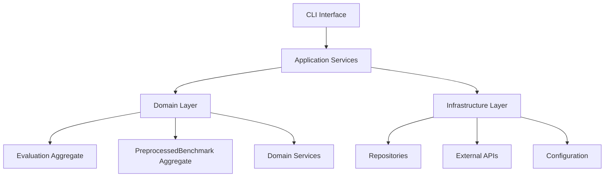
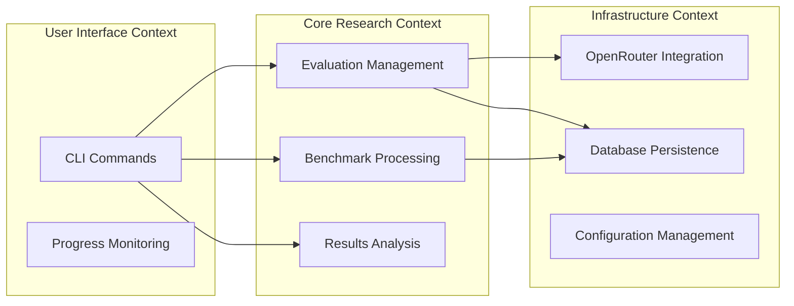
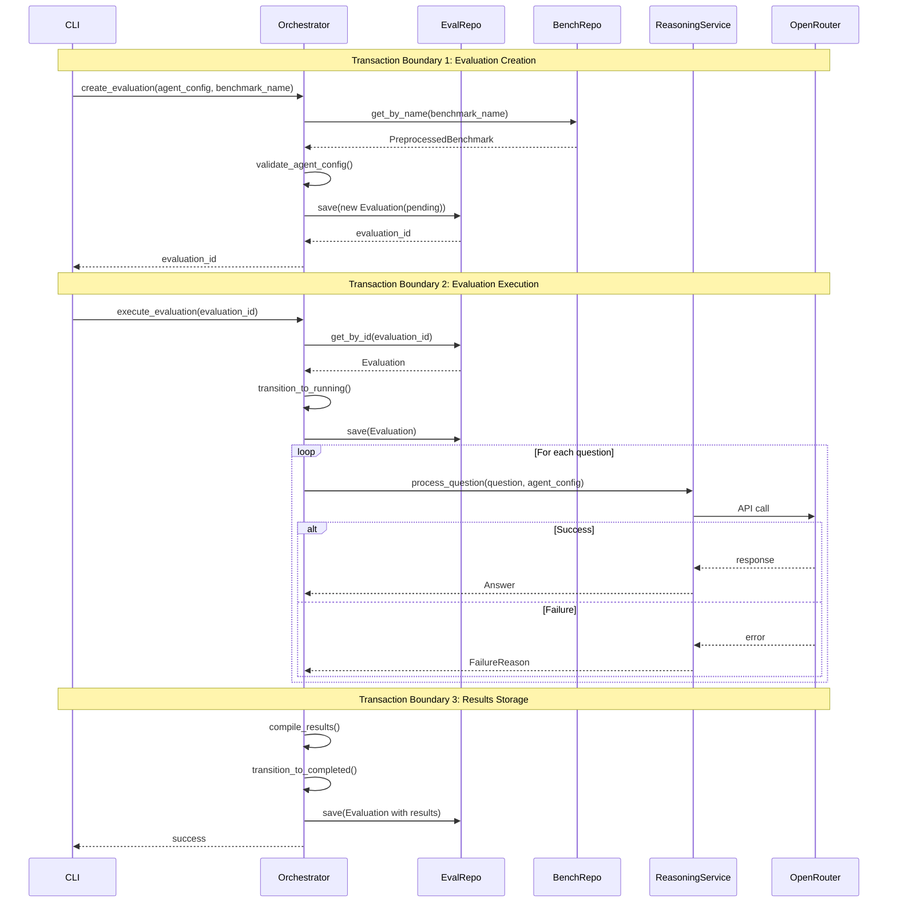
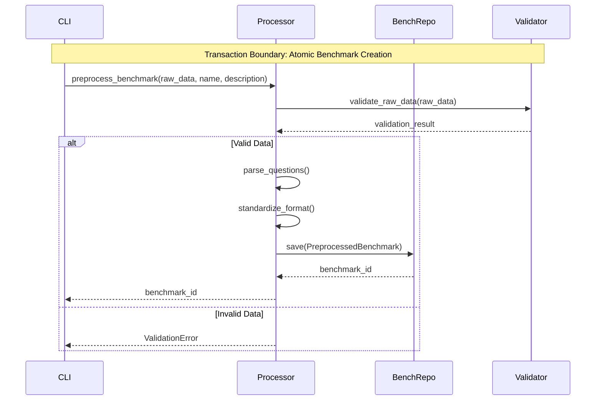
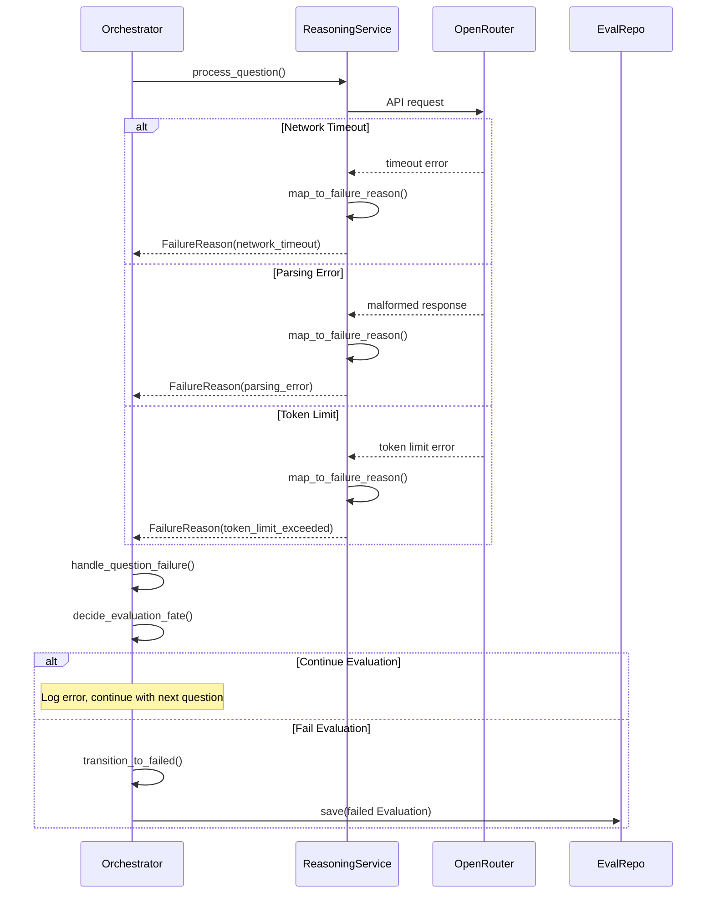
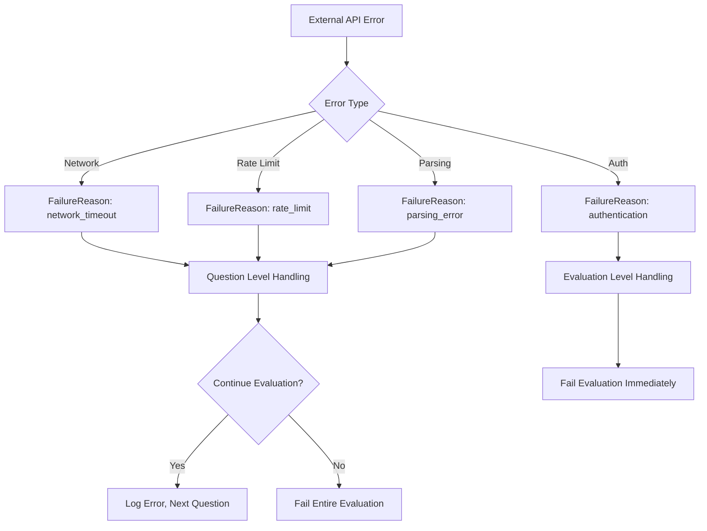
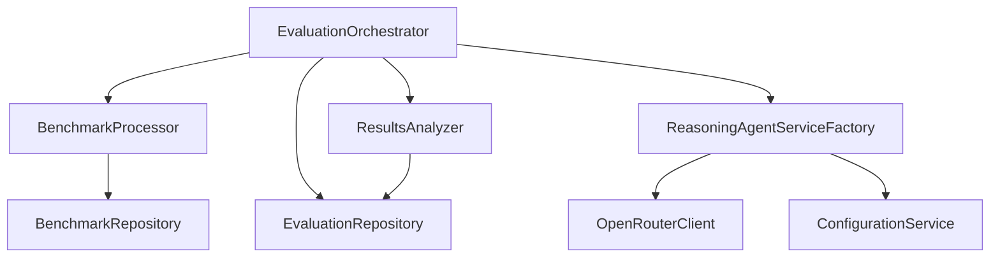

# Application Services Architecture

**Version:** 1.0
**Date:** 2025-09-17
**Purpose:** Define orchestration layer between domain and infrastructure

## Architecture Overview

Application services orchestrate domain operations without containing business logic. They coordinate transactions, handle cross-aggregate operations, and translate between external APIs and domain concepts.



## Bounded Context Mapping



## Application Service Interfaces

### EvaluationOrchestrator

Primary service coordinating evaluation lifecycle.

```python
class EvaluationOrchestrator:
    def __init__(
        self,
        evaluation_repo: EvaluationRepository,
        benchmark_repo: PreprocessedBenchmarkRepository,
        reasoning_service_factory: ReasoningAgentServiceFactory,
        config: ApplicationConfig
    ):
        pass

    def create_evaluation(
        self,
        agent_config: AgentConfig,
        benchmark_name: str
    ) -> EvaluationId:
        """Create new evaluation in pending state"""
        pass

    def execute_evaluation(self, evaluation_id: EvaluationId) -> None:
        """Execute evaluation asynchronously"""
        pass

    def get_evaluation_status(self, evaluation_id: EvaluationId) -> EvaluationStatus:
        """Check current evaluation state"""
        pass

    def get_evaluation_results(self, evaluation_id: EvaluationId) -> EvaluationResults:
        """Retrieve completed evaluation results"""
        pass
```

### BenchmarkProcessor

Handles benchmark preprocessing and management.

```python
class BenchmarkProcessor:
    def __init__(
        self,
        benchmark_repo: PreprocessedBenchmarkRepository,
        config: ApplicationConfig
    ):
        pass

    def preprocess_benchmark(
        self,
        raw_data: str,
        benchmark_name: str,
        description: str
    ) -> BenchmarkId:
        """Process raw benchmark data into standardized format"""
        pass

    def list_available_benchmarks(self) -> List[BenchmarkInfo]:
        """Get all preprocessed benchmarks"""
        pass

    def get_benchmark_details(self, benchmark_name: str) -> PreprocessedBenchmark:
        """Retrieve specific benchmark with questions"""
        pass
```

### ResultsAnalyzer

Provides analysis and reporting capabilities.

```python
class ResultsAnalyzer:
    def __init__(
        self,
        evaluation_repo: EvaluationRepository,
        config: ApplicationConfig
    ):
        pass

    def get_evaluation_summary(self, evaluation_id: EvaluationId) -> EvaluationSummary:
        """Get high-level results summary"""
        pass

    def export_detailed_results(
        self,
        evaluation_id: EvaluationId,
        format: ExportFormat
    ) -> str:
        """Export detailed results to CSV/JSON"""
        pass

    def list_evaluations(
        self,
        filters: EvaluationFilters = None
    ) -> List[EvaluationInfo]:
        """List evaluations with optional filtering"""
        pass
```

## Data Transfer Objects (DTOs)

Application services use DTOs to transfer data across layer boundaries while keeping domain entities encapsulated.

### EvaluationInfo

Summary information for evaluation listings and status displays.

```python
@dataclass(frozen=True)
class EvaluationInfo:
    evaluation_id: uuid.UUID
    agent_type: str
    model_name: str
    benchmark_name: str
    status: str
    accuracy: float | None
    created_at: datetime
    completed_at: datetime | None
    total_questions: int | None
    correct_answers: int | None

    @property
    def is_completed(self) -> bool:
        return self.status == "completed"

    @property
    def accuracy_percentage(self) -> str:
        return f"{self.accuracy:.1f}%" if self.accuracy else "-"

    @property
    def duration_minutes(self) -> float | None:
        if self.completed_at and self.created_at:
            return (self.completed_at - self.created_at).total_seconds() / 60
        return None
```

### ProgressInfo

Real-time progress tracking during evaluation execution.

```python
@dataclass(frozen=True)
class ProgressInfo:
    evaluation_id: uuid.UUID
    current_question: int
    total_questions: int
    successful_answers: int
    failed_questions: int
    started_at: datetime
    last_updated: datetime

    @property
    def completion_percentage(self) -> float:
        return (self.current_question / self.total_questions) * 100 if self.total_questions > 0 else 0.0

    @property
    def success_rate(self) -> float:
        answered = self.successful_answers + self.failed_questions
        return (self.successful_answers / answered) * 100 if answered > 0 else 0.0

    @property
    def estimated_remaining_minutes(self) -> float | None:
        elapsed = self.elapsed_minutes
        if elapsed > 0 and self.current_question > 0:
            time_per_question = elapsed / self.current_question
            remaining_questions = self.total_questions - self.current_question
            return time_per_question * remaining_questions
        return None
```

### ValidationResult

Immutable validation result aggregation across multiple validation steps.

```python
@dataclass(frozen=True)
class ValidationResult:
    is_valid: bool
    errors: List[str]
    warnings: List[str]

    @classmethod
    def success(cls, warnings: List[str] = None) -> "ValidationResult":
        return cls(is_valid=True, errors=[], warnings=warnings or [])

    @classmethod
    def failure(cls, errors: List[str], warnings: List[str] = None) -> "ValidationResult":
        return cls(is_valid=False, errors=errors, warnings=warnings or [])

    def combine(self, other: "ValidationResult") -> "ValidationResult":
        return ValidationResult(
            is_valid=self.is_valid and other.is_valid,
            errors=self.errors + other.errors,
            warnings=self.warnings + other.warnings,
        )
```

## Core Workflows with Sequence Diagrams

### 1. Create and Execute Evaluation



### 2. Benchmark Preprocessing



### 3. Error Propagation Flow



## Transaction Boundaries

### 1. Evaluation Creation Transaction

- **Scope:** Validate config → Create evaluation entity → Persist
- **Rollback Triggers:** Invalid agent config, duplicate evaluation, benchmark not found
- **Isolation:** Read committed (concurrent creations allowed)

### 2. Question Processing Transaction

- **Scope:** Per-question processing and individual result storage
- **Rollback Triggers:** Critical system errors (not LLM failures)
- **Isolation:** Optimistic locking on evaluation record

### 3. Results Compilation Transaction

- **Scope:** Aggregate all answers → Compute metrics → Update evaluation
- **Rollback Triggers:** Calculation errors, concurrent modification
- **Isolation:** Pessimistic lock on evaluation during completion

### 4. Benchmark Creation Transaction

- **Scope:** Parse raw data → Validate questions → Create benchmark
- **Rollback Triggers:** Invalid format, duplicate name, parsing errors
- **Isolation:** Exclusive lock on benchmark name

## Error Handling Strategy

### Error Categories and Propagation



### Failure Recovery Patterns

1. **Question-Level Failures:** Log and continue
2. **Configuration Failures:** Fail fast during creation
3. **Infrastructure Failures:** Retry with exponential backoff
4. **Business Logic Failures:** Immediate failure with detailed context

## Cross-Service Communication

### Service Dependencies



### Interface Contracts

- **Repository Interfaces:** Domain-driven, infrastructure-agnostic
- **External Service Interfaces:** Abstracted behind domain services
- **Configuration Interfaces:** Environment-aware, validation included

## Concurrency and Performance

### Async Operation Patterns

- **Evaluation Execution:** Fire-and-forget with status polling
- **Question Processing:** Sequential (simplicity over parallelization)
- **Results Retrieval:** Cached after completion

### Resource Management

- **Connection Pooling:** OpenRouter API connections
- **Rate Limiting:** Built into OpenRouter client
- **Memory Management:** Stream large result sets

## Validation Layers

### Input Validation

```python
@dataclass
class ValidationResult:
    is_valid: bool
    errors: List[str]
    warnings: List[str]
```

1. **CLI Layer:** Basic input sanitization and format validation
2. **Application Layer:** Business rule validation and cross-aggregate checks
3. **Domain Layer:** Entity invariants and value object constraints
4. **Infrastructure Layer:** Data persistence validation

## Configuration Management Integration

### Application Configuration Structure

```python
@dataclass
class ApplicationConfig:
    database_url: str
    openrouter_api_key: str
    openrouter_base_url: str
    max_concurrent_evaluations: int
    question_timeout_seconds: int
    retry_attempts: int
    log_level: str
```

### 12-Factor Compliance

- **Environment Variables:** All external dependencies configurable
- **No Hardcoded Values:** All settings externalized
- **Environment Parity:** Same config structure across dev/staging/prod

---

## Implementation Checklist

- [x] Define application service interfaces
- [x] Implement transaction boundary management (TransactionManager)
- [x] Create error mapping from external APIs to domain failures (ApplicationErrorMapper)
- [x] Set up async execution patterns for evaluations (EvaluationOrchestrator)
- [x] Implement validation pipeline across all layers (ValidationResult DTOs)
- [x] Configure logging and monitoring integration
- [x] Create configuration management system
- [x] Set up repository dependency injection (dependency injection container)

## Testing Implementation

The application services layer includes comprehensive high-value testing focusing on critical business workflows and integration points.

### Test Structure

```
tests/unit/application/
├── conftest.py              # Application layer fixtures and mocks
├── test_dtos.py            # DTO property calculations and validation
├── test_error_mapper.py    # External API error mapping
├── test_evaluation_orchestrator.py  # Core orchestration workflows
└── test_integration.py     # Service coordination and end-to-end flows
```

### Testing Approach

**Pragmatic Testing Strategy**: Focus on high-value scenarios rather than exhaustive coverage:

- **Critical Business Workflows**: Evaluation creation, execution, and completion
- **Error Handling**: External service failures, validation errors, network issues
- **Integration Points**: Service coordination, repository interactions, async operations
- **DTO Calculations**: Progress tracking, accuracy percentages, time estimates

### Key Test Examples

**Evaluation Orchestrator Testing**:
```python
async def test_execute_evaluation_basic_workflow(self, orchestrator, sample_evaluation):
    await orchestrator.execute_evaluation(evaluation_id)
    assert mock_reasoning_agent.answer_question.call_count == len(sample_benchmark.questions)
    # Verify final evaluation state
    final_evaluation = mock_evaluation_repository.update.call_args_list[-1][0][0]
    assert final_evaluation.status == "completed"
```

**Error Mapping Testing**:
```python
def test_map_openrouter_rate_limit_error(self, error_mapper):
    error = MockRateLimitError("Rate limit exceeded")
    failure_reason = error_mapper.map_openrouter_error(error)
    assert failure_reason.category == "rate_limit_exceeded"
    assert failure_reason.recoverable is True
```

**DTO Testing**:
```python
def test_progress_info_calculations(self, sample_progress_info):
    assert sample_progress_info.completion_percentage == 60.0
    assert sample_progress_info.success_rate == pytest.approx(83.33, rel=1e-2)
```

### Test Results

- **389 tests passing** across domain, application, and infrastructure layers
- **Quality gates passing**: pytest, mypy, black, ruff
- **Async testing support**: Proper AsyncMock usage for evaluation execution
- **Integration coverage**: End-to-end workflow validation with mocked external services

## See Also

- **[Domain Model](v2-domain-model.md)** - Business entities coordinated by these application services
- **[Core Behaviors](v2-core-behaviour-definition.md)** - User workflows orchestrated by these services
- **[Infrastructure Requirements](v2-infrastructure-requirements.md)** - External system integrations used by services
- **[Data Model](v2-data-model.md)** - Persistence patterns implemented by repositories
- **[Project Structure](v2-project-structure.md)** - Service layer organization and dependencies
