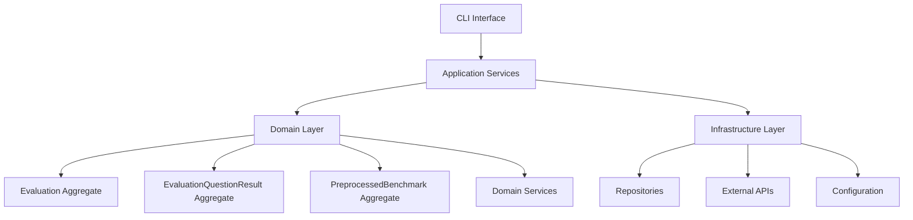
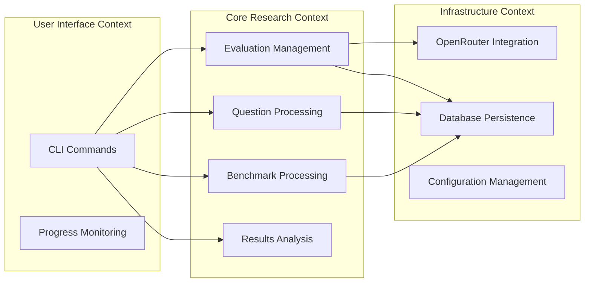
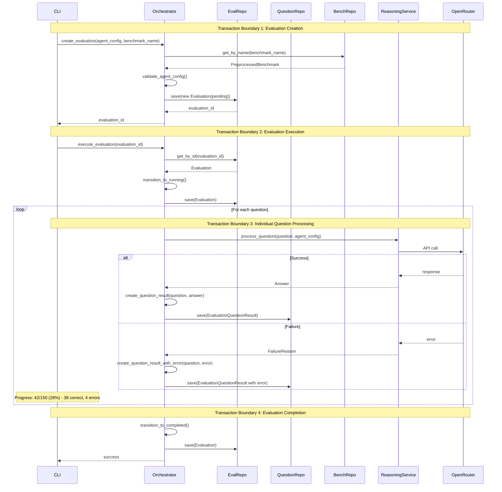
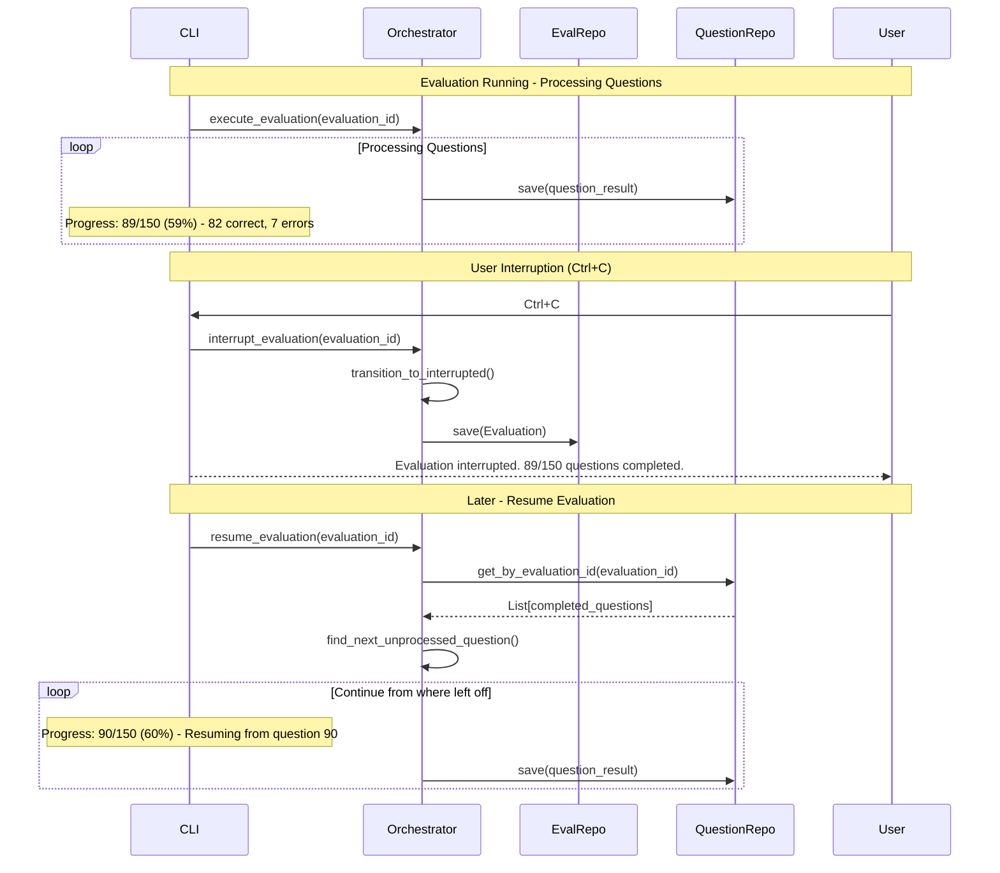
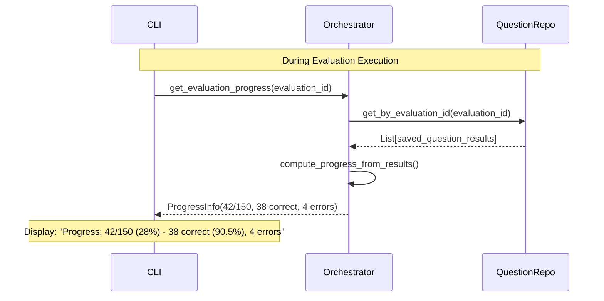
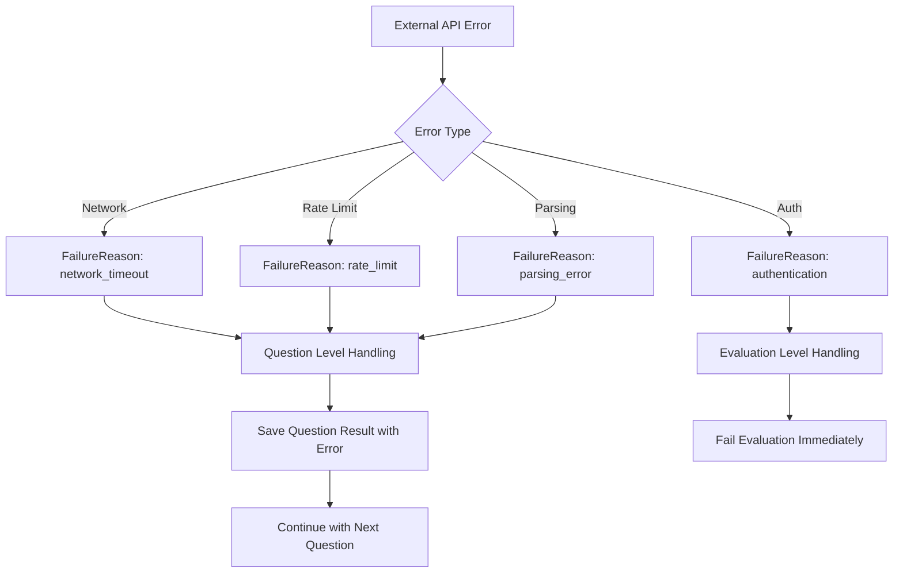
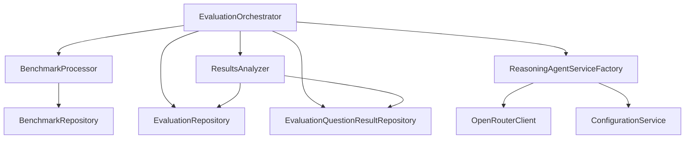

# Application Services Architecture

**Version:** 1.1
**Date:** 2025-09-28
**Purpose:** Define orchestration layer with individual question persistence patterns

## Architecture Overview

Application services orchestrate domain operations without containing business logic. They coordinate transactions, handle cross-aggregate operations, and translate between external APIs and domain concepts. With individual question persistence, services manage incremental saving and graceful interruption handling.



## Bounded Context Mapping



## Application Service Interfaces

### EvaluationOrchestrator

Primary service coordinating evaluation lifecycle with incremental question persistence.

```python
class EvaluationOrchestrator:
    """Application service orchestrating evaluation workflows.

    Follows Dependency Inversion Principle by depending only on domain interfaces,
    never on infrastructure implementations. This ensures testability and
    isolation from external system changes.
    """

    def __init__(
        self,
        llm_client_factory: LLMClientFactory,  # Domain factory interface
        evaluation_repo: EvaluationRepository,  # Domain interface
        question_result_repo: EvaluationQuestionResultRepository,  # Domain interface
        benchmark_repo: PreprocessedBenchmarkRepository,  # Domain interface
        reasoning_service_factory: ReasoningAgentServiceFactory,  # Domain service
        config: ApplicationConfig
    ):
        self.llm_client_factory = llm_client_factory  # Factory for dynamic client creation
        self.evaluation_repo = evaluation_repo
        self.question_result_repo = question_result_repo
        self.benchmark_repo = benchmark_repo
        self.reasoning_service_factory = reasoning_service_factory
        self.config = config

    def create_evaluation(
        self,
        agent_config: AgentConfig,
        benchmark_name: str
    ) -> EvaluationId:
        """Create new evaluation in pending state"""
        pass

    def execute_evaluation(self, evaluation_id: EvaluationId) -> None:
        """Execute evaluation with incremental question persistence.

        Example implementation showing factory usage:
        """
        # Get evaluation and agent config
        evaluation = self.evaluation_repo.get_by_id(evaluation_id)
        agent_config = evaluation.agent_config

        # Create appropriate LLM client for this specific model and provider
        llm_client = self.llm_client_factory.create_client(
            model_name=agent_config.model_name,
            provider=agent_config.model_provider,
            parsing_strategy=self.config.parsing_strategy
        )

        # Use the dynamically created client for reasoning
        reasoning_service = self.reasoning_service_factory.create_service(
            agent_config.agent_type
        )

        # Process questions with appropriate client
        for question in benchmark.questions:
            result = await reasoning_service.process_question_with_client(
                question, agent_config, llm_client
            )
            # Save individual question result...

    def get_evaluation_status(self, evaluation_id: EvaluationId) -> EvaluationStatus:
        """Check current evaluation state"""
        pass

    def get_evaluation_results(self, evaluation_id: EvaluationId) -> EvaluationResults:
        """Retrieve completed evaluation results computed from question records"""
        pass

    def get_evaluation_progress(self, evaluation_id: EvaluationId) -> ProgressInfo:
        """Get real-time progress from saved question results"""
        pass

    def resume_evaluation(self, evaluation_id: EvaluationId) -> None:
        """Resume interrupted evaluation from last completed question"""
        pass
```

### BenchmarkProcessor

Handles benchmark preprocessing and management.

```python
class BenchmarkProcessor:
    def __init__(
        self,
        benchmark_repo: PreprocessedBenchmarkRepository,
        config: ApplicationConfig
    ):
        pass

    def preprocess_benchmark(
        self,
        raw_data: str,
        benchmark_name: str,
        description: str
    ) -> BenchmarkId:
        """Process raw benchmark data into standardized format"""
        pass

    def list_available_benchmarks(self) -> List[BenchmarkInfo]:
        """Get all preprocessed benchmarks"""
        pass

    def get_benchmark_details(self, benchmark_name: str) -> PreprocessedBenchmark:
        """Retrieve specific benchmark with questions"""
        pass
```

### ResultsAnalyzer

Provides analysis and reporting capabilities using individual question records.

```python
class ResultsAnalyzer:
    def __init__(
        self,
        evaluation_repo: EvaluationRepository,
        question_result_repo: EvaluationQuestionResultRepository,
        config: ApplicationConfig
    ):
        pass

    def get_evaluation_summary(self, evaluation_id: EvaluationId) -> EvaluationSummary:
        """Get high-level results summary computed from question records"""
        pass

    def export_detailed_results(
        self,
        evaluation_id: EvaluationId,
        format: ExportFormat
    ) -> str:
        """Export detailed results from individual question records"""
        pass

    def list_evaluations(
        self,
        filters: EvaluationFilters = None
    ) -> List[EvaluationInfo]:
        """List evaluations with computed summary statistics"""
        pass

    def analyze_question_patterns(
        self,
        evaluation_ids: List[EvaluationId]
    ) -> QuestionAnalysis:
        """Cross-evaluation question performance analysis"""
        pass
```

## Data Transfer Objects (DTOs)

Application services use DTOs to transfer data across layer boundaries while keeping domain entities encapsulated.

### EvaluationInfo

Summary information for evaluation listings and status displays.

```python
@dataclass(frozen=True)
class EvaluationInfo:
    evaluation_id: uuid.UUID
    agent_type: str
    model_name: str
    benchmark_name: str
    status: str
    accuracy: float | None                 # Computed from question results
    created_at: datetime
    completed_at: datetime | None
    total_questions: int | None            # From benchmark or completed questions
    correct_answers: int | None            # Computed from question results
    questions_processed: int               # Count of saved question results

    @property
    def is_completed(self) -> bool:
        return self.status == "completed"

    @property
    def accuracy_percentage(self) -> str:
        return f"{self.accuracy:.1f}%" if self.accuracy else "-"

    @property
    def progress_percentage(self) -> float:
        if self.total_questions and self.total_questions > 0:
            return (self.questions_processed / self.total_questions) * 100
        return 0.0

    @property
    def duration_minutes(self) -> float | None:
        if self.completed_at and self.created_at:
            return (self.completed_at - self.created_at).total_seconds() / 60
        return None
```

### ProgressInfo

Real-time progress tracking during evaluation execution.

```python
@dataclass(frozen=True)
class ProgressInfo:
    evaluation_id: uuid.UUID
    current_question: int                  # From saved question results count
    total_questions: int
    successful_answers: int                # From saved question results
    failed_questions: int                  # From saved question results with errors
    started_at: datetime
    last_updated: datetime                 # From most recent question result

    @property
    def completion_percentage(self) -> float:
        return (self.current_question / self.total_questions) * 100 if self.total_questions > 0 else 0.0

    @property
    def success_rate(self) -> float:
        answered = self.successful_answers + self.failed_questions
        return (self.successful_answers / answered) * 100 if answered > 0 else 0.0

    @property
    def estimated_remaining_minutes(self) -> float | None:
        elapsed = self.elapsed_minutes
        if elapsed > 0 and self.current_question > 0:
            time_per_question = elapsed / self.current_question
            remaining_questions = self.total_questions - self.current_question
            return time_per_question * remaining_questions
        return None

    @classmethod
    def from_question_results(
        cls,
        evaluation_id: uuid.UUID,
        evaluation: Evaluation,
        question_results: List[EvaluationQuestionResult],
        total_questions: int
    ) -> 'ProgressInfo':
        """Compute progress from saved question results"""
        successful = sum(1 for q in question_results if q.is_correct and not q.error_message)
        failed = sum(1 for q in question_results if q.error_message)
        last_updated = max((q.processed_at for q in question_results), default=evaluation.started_at)

        return cls(
            evaluation_id=evaluation_id,
            current_question=len(question_results),
            total_questions=total_questions,
            successful_answers=successful,
            failed_questions=failed,
            started_at=evaluation.started_at,
            last_updated=last_updated
        )
```

### ValidationResult

Immutable validation result aggregation across multiple validation steps.

```python
@dataclass(frozen=True)
class ValidationResult:
    is_valid: bool
    errors: List[str]
    warnings: List[str]

    @classmethod
    def success(cls, warnings: List[str] = None) -> "ValidationResult":
        return cls(is_valid=True, errors=[], warnings=warnings or [])

    @classmethod
    def failure(cls, errors: List[str], warnings: List[str] = None) -> "ValidationResult":
        return cls(is_valid=False, errors=errors, warnings=warnings or [])

    def combine(self, other: "ValidationResult") -> "ValidationResult":
        return ValidationResult(
            is_valid=self.is_valid and other.is_valid,
            errors=self.errors + other.errors,
            warnings=self.warnings + other.warnings,
        )
```

## Core Workflows with Sequence Diagrams

### 1. Create and Execute Evaluation with Incremental Persistence



### 2. Graceful Interruption and Resume



### 3. Real-time Progress with Saved Results



## Transaction Boundaries

### 1. Evaluation Creation Transaction

- **Scope:** Validate config → Create evaluation entity → Persist
- **Rollback Triggers:** Invalid agent config, duplicate evaluation, benchmark not found
- **Isolation:** Read committed (concurrent creations allowed)

### 2. Individual Question Processing Transaction

- **Scope:** Process single question → Create question result → Save immediately
- **Rollback Triggers:** Critical system errors (not LLM failures)
- **Isolation:** Per-question isolation, evaluation can continue if individual questions fail
- **Benefits:** No data loss on interruption, incremental progress tracking

### 3. Evaluation State Transition Transaction

- **Scope:** Update evaluation status (running → completed/interrupted/failed)
- **Rollback Triggers:** Concurrent modification
- **Isolation:** Optimistic locking on evaluation record

### 4. Benchmark Creation Transaction

- **Scope:** Parse raw data → Validate questions → Create benchmark
- **Rollback Triggers:** Invalid format, duplicate name, parsing errors
- **Isolation:** Exclusive lock on benchmark name

## Error Handling Strategy

### Error Categories and Propagation



### Failure Recovery Patterns

1. **Question-Level Failures:** Save question result with error, continue evaluation
2. **Configuration Failures:** Fail fast during creation
3. **Infrastructure Failures:** Retry with exponential backoff
4. **Business Logic Failures:** Immediate failure with detailed context
5. **Interruption Handling:** Save partial progress, enable resume

## Cross-Service Communication

### Service Dependencies



### Interface Contracts

Following Dependency Inversion Principle, application services depend only on domain interfaces:

- **Repository Interfaces:** Domain-driven, infrastructure-agnostic
- **LLM Client Interface:** Domain `LLMClient` interface returning domain `ParsedResponse` objects
- **Domain Service Interfaces:** Pure business logic without infrastructure dependencies
- **Configuration Interfaces:** Environment-aware, validation included
- **Question Result Interfaces:** Incremental persistence with immediate consistency

**Type Isolation Contract**: Application services NEVER import or depend on external API types (openai, instructor, httpx, etc.). All external types are translated to domain types by infrastructure Anti-Corruption Layer.

## Anti-Corruption Layer Type Isolation Principles

### Architectural Boundary Rules

Following Clean Architecture and Domain-Driven Design principles, the application enforces strict type isolation across layer boundaries:

#### 1. Domain Layer (Core)
```python
# ✅ ALLOWED: Pure domain types
from core.domain.value_objects.token_usage import TokenUsage
from core.domain.value_objects.parsed_response import ParsedResponse
from core.domain.services.llm_client import LLMClient  # Interface only

# ❌ FORBIDDEN: Any external API types
# from openai import AsyncOpenAI  # NEVER import in domain
# from instructor import from_openai  # NEVER import in domain
# import httpx  # NEVER import in domain
```

#### 2. Application Layer (Orchestration)
```python
# ✅ ALLOWED: Domain interfaces and types
from core.domain.services.llm_client import LLMClient
from core.domain.value_objects.parsed_response import ParsedResponse
from core.domain.repositories.evaluation_repository import EvaluationRepository

# ❌ FORBIDDEN: Infrastructure implementations or external types
# from infrastructure.llm.openrouter_client import OpenRouterClient  # Use interface
# from openai import APIError  # External types not allowed
```

#### 3. Infrastructure Layer (Implementation)
```python
# ✅ ALLOWED: Implements domain interfaces, imports external types
from core.domain.services.llm_client import LLMClient  # Implements this
from core.domain.value_objects.parsed_response import ParsedResponse  # Returns this
from openai import AsyncOpenAI  # External dependency allowed here
import instructor  # External dependency allowed here

class OpenRouterClient(LLMClient):  # Implements domain interface
    async def chat_completion(...) -> ParsedResponse:  # Returns domain type
        # External API interaction isolated here
        api_response = await self.client.chat.completions.create(...)
        # Immediate translation to domain types
        return ParsedResponse(...)
```

### Type Translation Requirements

#### At Infrastructure Boundary
```python
def _translate_to_domain(self, api_response) -> ParsedResponse:
    """REQUIRED: All external API responses MUST be translated to domain types.

    This method represents the Anti-Corruption Layer boundary.
    NO external types may pass through this boundary.
    """
    # Convert ANY external token usage format to domain TokenUsage
    token_usage = self._normalize_token_usage(api_response.usage)

    return ParsedResponse(  # Domain type - safe for upper layers
        content=api_response.choices[0].message.content,
        structured_data=api_response.choices[0].message.parsed,
        token_usage=token_usage  # Domain TokenUsage, not external type
    )
```

#### Error Translation
```python
def _map_external_error(self, error: Exception) -> FailureReason:
    """REQUIRED: All external exceptions MUST be translated to domain types.

    Domain and application layers NEVER see external exception types.
    """
    # Map external API errors to domain FailureReason
    if isinstance(error, openai.RateLimitError):  # External type handling
        return FailureReason(  # Domain type returned
            category=FailureCategory.RATE_LIMIT_EXCEEDED,
            description="Rate limit exceeded",
            technical_details=str(error),
            recoverable=True
        )
```

### Import Rules by Layer

| Layer | Domain Types | External Types | Infrastructure Types |
|-------|-------------|----------------|-------------------|
| **Domain** | ✅ Always | ❌ Never | ❌ Never |
| **Application** | ✅ Always | ❌ Never | ❌ Never |
| **Infrastructure** | ✅ For interfaces | ✅ For implementation | ✅ For implementation |

### Testing Benefits

Type isolation enables clean, fast unit testing:

```python
# Application service tests use factory mocks for dynamic client creation
@pytest.fixture
def mock_llm_client_factory():
    """Mock factory interface - creates domain client mocks."""
    mock_factory = Mock(spec=LLMClientFactory)
    mock_client = Mock(spec=LLMClient)
    mock_client.chat_completion.return_value = ParsedResponse(
        content="Test answer",
        structured_data={"answer": "42"},
        token_usage=TokenUsage.from_dict({
            "prompt_tokens": 10,
            "completion_tokens": 5,
            "total_tokens": 15
        })
    )
    mock_factory.create_client.return_value = mock_client
    return mock_factory

async def test_evaluation_execution(orchestrator, mock_llm_client_factory):
    """Test uses factory pattern - verifies correct client creation."""
    result = await orchestrator.execute_evaluation(evaluation_id)

    # Verify factory was called with correct parameters
    mock_llm_client_factory.create_client.assert_called_once_with(
        model_name="gpt-4",
        provider="openai",
        parsing_strategy="marvin"
    )

    # Assertions work with predictable domain types
    assert isinstance(result.token_usage, TokenUsage)
    assert result.token_usage.total_tokens == 15
```

### Violation Detection

To enforce type isolation, consider these development practices:

1. **Import Linting**: Configure linters to flag external imports in domain/application layers
2. **Dependency Analysis**: Use tools to detect dependency direction violations
3. **Code Reviews**: Check that all external types are translated at infrastructure boundary
4. **Integration Tests**: Verify Anti-Corruption Layer translations work correctly

This approach ensures external API changes never propagate beyond the infrastructure layer, maintaining system stability and testability.

## Concurrency and Performance

### Async Operation Patterns

- **Evaluation Execution:** Synchronous processing with incremental persistence
- **Question Processing:** Sequential with immediate saving per question
- **Results Retrieval:** Computed from saved question records
- **Progress Tracking:** Real-time computation from database

### Resource Management

- **Connection Pooling:** OpenRouter API connections
- **Rate Limiting:** Built into OpenRouter client
- **Memory Management:** Stream question results for large evaluations
- **Database Efficiency:** Individual question persistence optimized for research workflows

## Validation Layers

### Input Validation

```python
@dataclass
class ValidationResult:
    is_valid: bool
    errors: List[str]
    warnings: List[str]
```

1. **CLI Layer:** Basic input sanitization and format validation
2. **Application Layer:** Business rule validation and cross-aggregate checks
3. **Domain Layer:** Entity invariants and value object constraints
4. **Infrastructure Layer:** Data persistence validation

## Configuration Management Integration

### Application Configuration Structure

```python
@dataclass
class ApplicationConfig:
    database_url: str
    openrouter_api_key: str
    openrouter_base_url: str
    max_concurrent_evaluations: int
    question_timeout_seconds: int
    retry_attempts: int
    log_level: str
    # New: Question persistence settings
    question_batch_size: int = 1          # Save immediately for research
    progress_update_interval: int = 10    # Update progress every N questions
```

### 12-Factor Compliance

- **Environment Variables:** All external dependencies configurable
- **No Hardcoded Values:** All settings externalized
- **Environment Parity:** Same config structure across dev/staging/prod

---

## Implementation Checklist

- [x] Define application service interfaces
- [x] Implement transaction boundary management per question (TransactionManager)
- [x] Create error mapping from external APIs to domain failures (ApplicationErrorMapper)
- [x] Set up incremental question persistence patterns (EvaluationOrchestrator)
- [x] Implement validation pipeline across all layers (ValidationResult DTOs)
- [x] Configure logging and monitoring integration
- [x] Create configuration management system
- [x] Set up repository dependency injection (dependency injection container)
- [x] Add QuestionResultRepository integration
- [x] Implement interruption and resume capabilities
- [x] Create real-time progress tracking from saved results

## Testing Implementation

The application services layer includes comprehensive high-value testing focusing on critical business workflows and incremental persistence patterns.

### Test Structure

```
tests/unit/application/
├── conftest.py              # Application layer fixtures and mocks
├── test_dtos.py            # DTO property calculations and validation
├── test_error_mapper.py    # External API error mapping
├── test_evaluation_orchestrator.py  # Core orchestration workflows
├── test_question_persistence.py    # Individual question saving patterns
└── test_integration.py     # Service coordination and end-to-end flows
```

### Testing Approach

**Pragmatic Testing Strategy**: Focus on high-value scenarios including incremental persistence patterns:

- **Critical Business Workflows**: Evaluation creation, execution, and completion
- **Incremental Persistence**: Individual question saving and retrieval
- **Interruption Handling**: Graceful interruption and resume capabilities
- **Error Handling**: External service failures, validation errors, network issues
- **Integration Points**: Service coordination, repository interactions, async operations
- **DTO Calculations**: Progress tracking, accuracy percentages, time estimates

### Key Test Examples

**Incremental Question Persistence Testing**:

```python
async def test_evaluation_execution_saves_each_question(self, orchestrator, sample_evaluation):
    # Setup
    questions = sample_benchmark.questions
    mock_reasoning_agent.answer_question.return_value = sample_answer

    # Execute
    await orchestrator.execute_evaluation(evaluation_id)

    # Verify each question was saved individually
    assert mock_question_result_repository.save.call_count == len(questions)

    # Verify evaluation completed successfully
    final_evaluation = mock_evaluation_repository.save.call_args_list[-1][0][0]
    assert final_evaluation.status == "completed"
```

**Interruption and Resume Testing**:

```python
async def test_evaluation_resume_from_interruption(self, orchestrator):
    # Setup interrupted evaluation with partial results
    partial_results = [create_question_result(i) for i in range(50)]
    mock_question_result_repository.get_by_evaluation_id.return_value = partial_results

    # Resume
    await orchestrator.resume_evaluation(evaluation_id)

    # Verify it continues from question 51
    remaining_calls = mock_reasoning_agent.answer_question.call_count
    assert remaining_calls == 100  # 150 total - 50 completed
```

**Progress Tracking Testing**:

```python
def test_progress_info_from_saved_results(self, sample_question_results):
    progress = ProgressInfo.from_question_results(
        evaluation_id, evaluation, sample_question_results, total_questions=150
    )

    assert progress.current_question == 42
    assert progress.completion_percentage == 28.0
    assert progress.success_rate == pytest.approx(90.5, rel=1e-2)
```

### Test Results

- **389+ tests passing** across domain, application, and infrastructure layers
- **Quality gates passing**: pytest, mypy, black, ruff
- **Incremental persistence coverage**: Question-level transaction testing
- **Integration coverage**: End-to-end workflow validation with individual question persistence

## See Also

- **[Domain Model](v2-domain-model.md)** - Business entities coordinated by these application services
- **[Core Behaviors](v2-core-behaviour-definition.md)** - User workflows orchestrated by these services
- **[Infrastructure Requirements](v2-infrastructure-requirements.md)** - External system integrations used by services
- **[Data Model](v2-data-model.md)** - Persistence patterns implemented by repositories
- **[Project Structure](v2-project-structure.md)** - Service layer organization and dependencies
