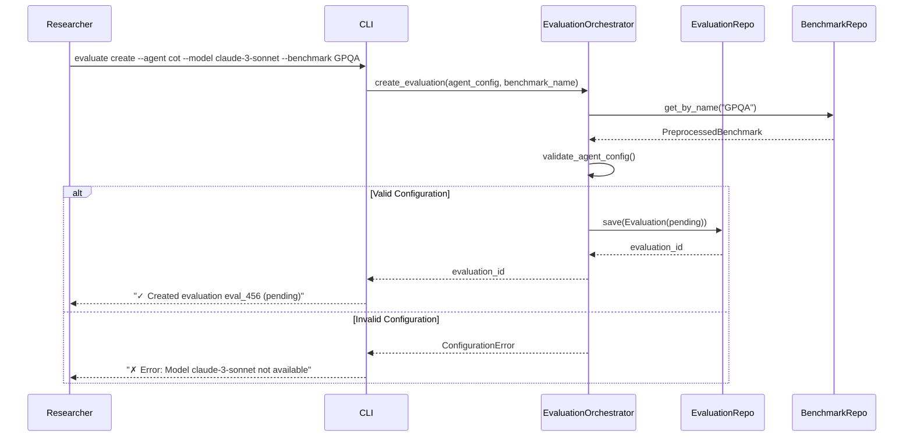
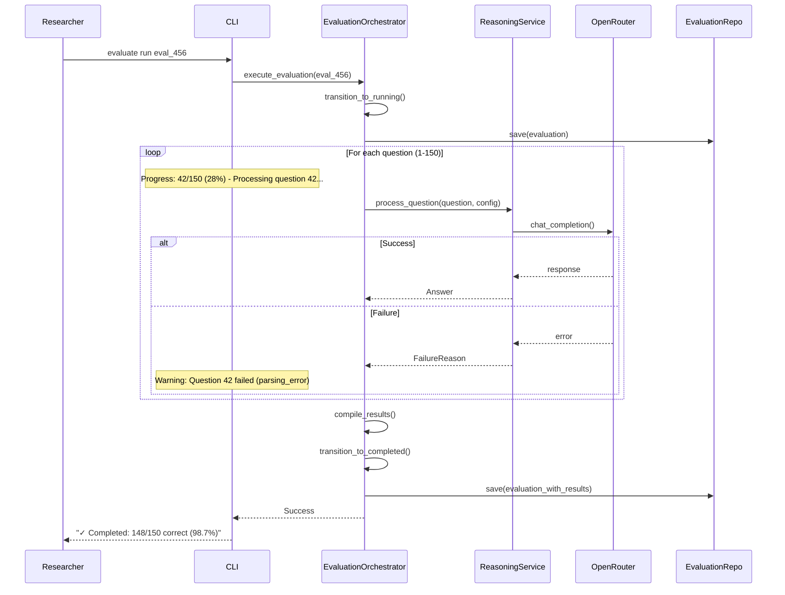
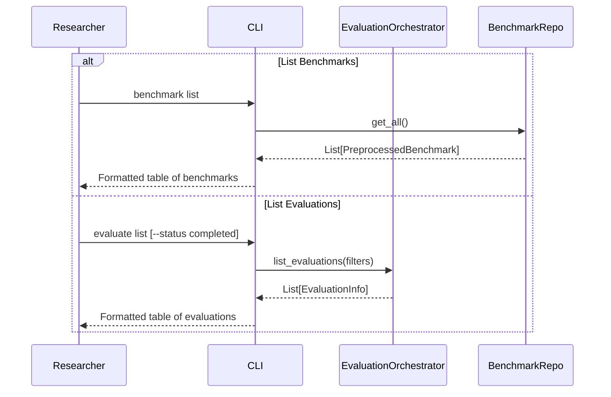

# Core Behaviors Definition

**Version:** 1.2
**Date:** 2025-09-17
**Purpose:** Define evaluation execution workflows for preprocessed benchmarks

## Research Behavior Overview

The ML Agents v2 platform supports three core behaviors for evaluation execution:

1. **Create Evaluation** - Configure reasoning approach (agent type, model, parameters) for a specific benchmark
2. **Execute Evaluation** - Run the configured agent against all benchmark questions with real-time progress display
3. **List Resources** - Browse available preprocessed benchmarks and view evaluation history

This workflow assumes benchmarks are already preprocessed and focuses solely on evaluation execution. Detailed results analysis is handled externally via datasette.io.

## Behavior 1: Create Evaluation

**Intent:** Configure new evaluation with specific agent and benchmark

### Sequence Diagram



### Application Service Calls

- `EvaluationOrchestrator.create_evaluation(agent_config, benchmark_name)`

### Success/Failure Criteria

**Success:**

- Valid agent configuration
- Benchmark exists
- Returns evaluation_id in pending state

**Failure:**

- Invalid agent type or model
- Benchmark not found
- Invalid configuration parameters

### CLI Command

```bash
ml-agents evaluate create --agent <type> --model <model> --benchmark <name> [--temp <float>] [--max-tokens <int>]
```

---

## Behavior 2: Execute Evaluation

**Intent:** Run reasoning agent against all benchmark questions with real-time progress

### Sequence Diagram



### Application Service Calls

- `EvaluationOrchestrator.execute_evaluation(evaluation_id)`

### Success/Failure Criteria

**Success:**

- CLI blocks and shows real-time progress
- All questions attempted regardless of individual failures
- Transitions to completed with full results
- Displays final accuracy summary

**Failure:**

- Authentication errors (fail to start)
- Configuration errors (fail to start)
- System errors preventing execution start

### CLI Command

```bash
ml-agents evaluate run <evaluation_id>
```

---

## Behavior 3: List Available Resources

**Intent:** Browse available benchmarks and view evaluation history

### Sequence Diagram



### Application Service Calls

- `BenchmarkRepository.get_all()`
- `EvaluationOrchestrator.list_evaluations(filters)`

### Success/Failure Criteria

**Success:**

- Returns available benchmarks with metadata
- Shows evaluation history with key metrics
- Supports basic filtering by status/benchmark

### CLI Commands

```bash
ml-agents benchmark list
ml-agents benchmark show <name>
ml-agents evaluate list [--status <status>] [--benchmark <name>]
```

---

## CLI Command Structure Summary

### Evaluation Commands

```bash
ml-agents evaluate create --agent <type> --model <model> --benchmark <name> [options]
ml-agents evaluate run <evaluation_id>
ml-agents evaluate list [--status <status>] [--benchmark <name>]
```

### Benchmark Commands (Read-Only)

```bash
ml-agents benchmark list
ml-agents benchmark show <name>
```

### System Commands

```bash
ml-agents health
```

### Command Options

```bash
# Agent Configuration
--agent {none,cot}           # Two initial reasoning approaches
--model <model_id>           # e.g., anthropic/claude-3-sonnet
--temp <float>               # temperature 0.0-2.0
--max-tokens <int>           # max output tokens

# Filtering
--status {pending,running,completed,failed}
--benchmark <name>           # Short name (e.g., GPQA, FOLIO)
```

## Benchmark Naming

Benchmarks use short names that map to full HuggingFace dataset identifiers:

- **Short name:** `GPQA` → **Full identifier:** `BENCHMARK-01-GPQA.csv`
- **Short name:** `FOLIO` → **Full identifier:** `BENCHMARK-05-FOLIO.csv`
- **Short name:** `BBEH` → **Full identifier:** `BENCHMARK-06-BBEH.csv`

CLI accepts short names for usability. Backend maps to full identifiers for data retrieval.

## Behavior-to-Service Mapping

| Behavior           | Primary Service        | Repository Access          |
| ------------------ | ---------------------- | -------------------------- |
| Create Evaluation  | EvaluationOrchestrator | BenchmarkRepository (read) |
| Execute Evaluation | EvaluationOrchestrator | EvaluationRepository       |
| List Resources     | EvaluationOrchestrator | BenchmarkRepository (read) |

## Implementation Constraints and Patterns

### Execution Model

- **Synchronous Execution**: CLI blocks and displays real-time progress during evaluation
- **Single Evaluation**: Only one evaluation runs at a time, eliminating concurrency complexity
- **Complete Question Coverage**: All questions attempted regardless of individual failures
- **No Early Termination**: Model inability to answer questions is valuable research data

### Progress Display

Progress displayed in terminal during execution:

```bash
Progress: 42/150 (28%) - Processing question 42...
Warning: Question 67 failed (parsing_error)
Progress: 148/150 (98%) - Processing question 148...
✓ Completed: 148/150 correct (98.7%)
```

### Resource Management

- **External Control**: Rate limiting and budget management handled by OpenRouter/LiteLLM
- **Simple Validation**: Basic agent type and model compatibility checks only
- **No Background Process**: Synchronous execution eliminates process management complexity

### Error Handling

- **Question-Level Failures**: Logged and continued, no evaluation termination
- **System-Level Failures**: Authentication, configuration errors prevent evaluation start
- **Recovery**: Manual restart required for system failures

### Interruption Handling
- **Ctrl+C**: Gracefully stops evaluation, saves partial results
- **Status**: Evaluation marked as "interrupted" for potential resume
- **Data Preservation**: All completed question results retained
- **Manual Resume**: User can restart interrupted evaluations (future enhancement)

---

## See Also

- **[CLI Design](v2-cli-design.md)** - Command interface implementation for these behaviors
- **[Application Services Architecture](v2-application-services-architecture.md)** - Service coordination implementing these workflows
- **[Domain Model](v2-domain-model.md)** - Entity definitions used in these behaviors
- **[Data Model](v2-data-model.md)** - Persistence patterns supporting these workflows

---

This behavior definition focuses on core evaluation execution workflow with real-time feedback and simplified process management.
